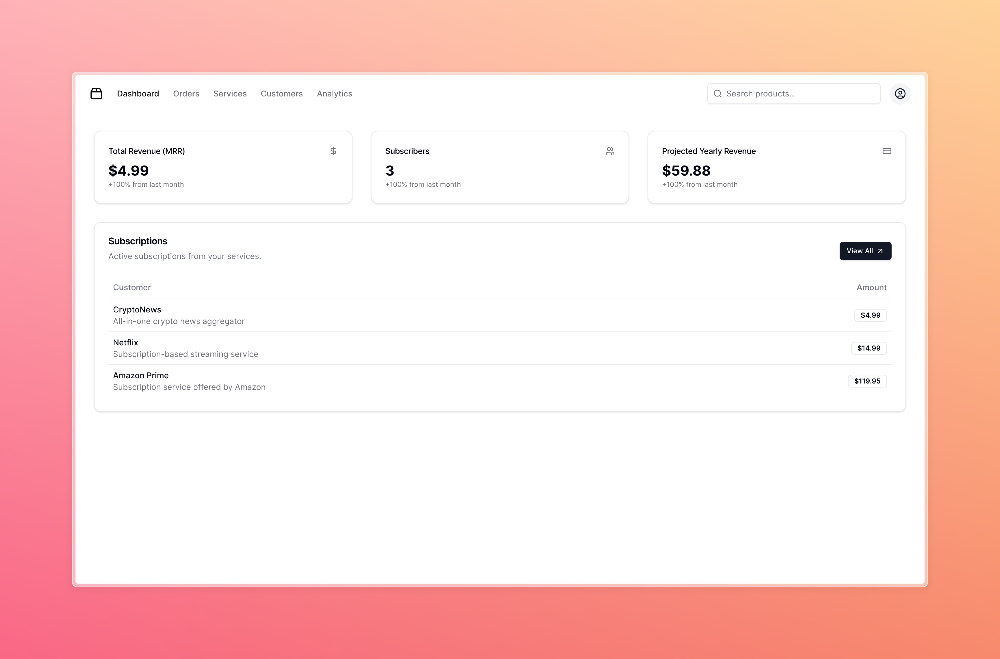

# Arrow



A Crypto Native Recurring Subscription Platform, The Stripe Of Web3.

## Problem

### The Current Landscape: Walled Gardens and Limited Control

Existing subscription platforms like Stripe, while convenient, often confine businesses within a closed ecosystem. This creates several challenges for vendors:

* Limited Customer Relationship Management: Vendors have restricted access to customer data and limited ability to directly interact with their subscribers. This hinders their ability to personalize the customer experience and build strong relationships.
* Data Ownership and Usage: Valuable customer data resides within the platform's infrastructure, not under the vendor's control. This restricts the vendor's ability to leverage data insights for marketing, product development, and customer retention strategies.
* Hidden Fees and Profit Erosion: Transaction fees associated with these platforms can accumulate and eat significantly into a vendor's profits, impacting their bottom line.

### Solution

Decentralization and Empowerment
Arrow seeks to revolutionize this model by offering a decentralized subscription platform built on blockchain technology. This empowers vendors by:

* Facilitating Direct Customer Connections: Arrow fosters a peer-to-peer approach, allowing vendors to interact directly with subscribers and build stronger relationships.
* Data Ownership and Flexibility: Vendors retain ownership of their customer data within the secure blockchain environment. This allows them to leverage data insights to their advantage.
* Reduced Transaction Fees: By leveraging the efficiency of blockchain technology, Arrow aims to minimize transaction fees and maximize vendor profits.

## Challenges

* Galadriel Contract Deployment: Encountered issues deploying Galadriel contracts using Hardhat. This could be due to configuration problems, network incompatibility, or bugs in the contracts themselves.

* Shell Protocol Testing: The shell protocol unit tests were failing consistently. This indicates potential errors in the protocol's logic or implementation.

### Solutions

* Deployment Workaround: Successfully deployed the Galadriel contracts using Remix as an alternative to Hardhat. While Remix might not be the ideal long-term solution, it demonstrates flexibility and problem-solving skills.

* Debugging Shell Protocols: Debugged and fixed the shell protocol errors, likely involving code revisions and test case adjustments. Focusing on integration despite challenges showcases perseverance and the ability to prioritize.

### Improvements

* Technical Specificity: Mention the specific errors encountered during deployment (e.g., "encountered 'revert' error during Galadriel contract migration").
* AI Integration: Briefly mention how the AI is involved in the recurring subscription model. Does it personalize subscription plans, predict customer churn, or optimize pricing?

## Getting Started

### Running the App Locally

To run the app on your local machine, navigate to the app directory, install the dependencies, and start the development server:

```sh
cd app
yarn
yarn dev
```

### Deploying the Contracts

To deploy the contracts, install the dependencies and use the Hardhat deploy command:

```sh
yarn
hh deploy --network <NETWORK> --contract <CONTRACT> --save --verify
```

Replace <NETWORK> and <CONTRACT> with the desired network and contract name, respectively.
